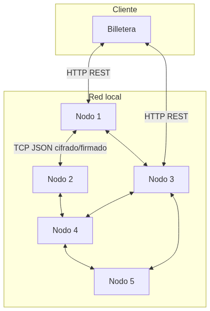

# HashCoin — Descripción inicial y general

Proyecto integrador para Computación II: una blockchain mínima con varios nodos que se comunican entre sí, minado distribuido con distinta capacidad por nodo, y una billetera opcional para consultar el estado como usuario.

---

## Objetivo en una frase

Demostrar una red de 5–6 nodos que mantienen una blockchain en común, con PoW repartido en múltiples núcleos por nodo (configurable), comunicación entre nodos y atención asincrónica a clientes, usando herramientas de la materia (sockets, asyncio, multiprocessing, IPC, colas, Docker).

---

## Componentes

| Componente | Rol |
|------------|-----|
| **Nodo** | Mantiene copia de la blockchain y del mempool de transacciones; valida transacciones y bloques; realiza PoW (minado) usando varios núcleos; se comunica con otros nodos (propagación de transacciones y bloques) y atiende consultas de forma asincrónica. Cada nodo puede tener distinta cantidad de núcleos asignados para ver cómo los que tienen más capacidad “dominan” el minado, sin poder alterar transacciones (integridad por consenso). |
| **Billetera** | Cliente opcional (extra si hay tiempo): permite ver balance y transacciones como si fuera un usuario; interfaz por consola; se conecta a uno o más nodos para consultar estado. No es el foco del proyecto. |
| **Usuario** | Entidad que en la práctica interactúa con la billetera (o, en una versión mínima, con el nodo vía CLI). Identificación vía par de claves (PKI) y firmas digitales en las transacciones. |

---

## Flujos principales

1. **Transacción**  
   Una transacción se crea (ej. desde billetera o herramienta CLI), se firma y se envía a un nodo. Ese nodo la valida (incl. firma) y la propaga al resto de nodos. Los nodos la añaden a su mempool y la reenvían.

2. **Bloque (minado y propagación)**  
   Un nodo arma un bloque con un conjunto de transacciones, añade la transacción de recompensa de minado y resuelve el PoW (hash con cierta dificultad) usando **múltiples núcleos/hilos** en paralelo (trabajo distribuido dentro del nodo). Cuando encuentra la solución, envía el bloque a los demás nodos. Cada nodo que lo recibe lo valida; si es válido, lo agrega a su cadena y lo retransmite. Si llega una cadena más larga y válida, el nodo reemplaza la suya (regla de la cadena más larga).

El PoW es **deliberadamente sencillo** (pocos ceros en el hash o condición similar) para poder correr todo en local (5–6 nodos en la misma máquina) y observar el comportamiento sin sobrecargar la CPU.

---

## Conceptos de la materia y dónde se usan

| Concepto | Uso en el proyecto |
|----------|---------------------|
| **Sockets** | Comunicación entre nodos (TCP) para propagar transacciones y bloques; posiblemente billetera ↔ nodo por socket o HTTP. |
| **Conexión de clientes múltiples de forma concurrente** | Cada nodo atiende muchas conexiones a la vez (otros nodos + billetera/consulta) de forma no bloqueante. |
| **Asincronismo de I/O** | Servidor del nodo con **asyncio** (`asyncio.start_server`, streams) para atender varias peticiones simultáneas sin bloquear. |
| **IPC** | Dentro del nodo: comunicación entre el “servidor” que recibe requests y los **workers** que hacen el cálculo del hash (PoW), usando por ejemplo **multiprocessing.Queue** (o similar) para repartir trabajo. |
| **Cola de tareas / trabajo distribuido** | Requests de minado (o tareas de hash) encoladas y procesadas por varios workers (multiprocessing) que usan distintos núcleos; así se demuestra que el trabajo distribuido acelera el PoW. |
| **Multiprocessing** | Cálculo del PoW repartido en varios procesos (o núcleos) por nodo; cada nodo puede tener distinta cantidad de núcleos asignados en Docker para ver diferencias de “poder” de minado. |
| **Parseo por línea de comandos** | **argparse** desde el inicio: puerto, host, cantidad de workers/núcleos, peers, ruta de BD, etc., tanto para el nodo como para la billetera. |
| **Sincronización** | Locks o estructuras thread-safe donde haga falta (ej. acceso a mempool y blockchain dentro del nodo). |
| **Docker** | **docker-compose** con 4–5 nodos (configuraciones distintas de núcleos por nodo) y 1 billetera; todo corre en local en la misma máquina. |

La documentación detallada (descripción verbal extendida, arquitectura y funcionalidades por entidad) se desarrolla en **doc/**.

---

## Decisiones de diseño resumidas

- **SQLite en lugar de MySQL**: menos complejidad de despliegue (sin contenedor de BD separado), un archivo por nodo/billetera, suficiente para el alcance del proyecto y para demostrar persistencia sin añadir requisitos de infraestructura. Si más adelante se quisiera escalar o replicar con MySQL, el diseño de capas puede mantenerse.
- **Billetera por consola**: el foco es la red de nodos y el minado distribuido; la billetera es un extra; consola mantiene el alcance acotado y evita complejidad de frontend.
- **PoW sencillo y varios nodos en local**: permite probar 5–6 nodos en una sola máquina (ej. 16 hilos / 8 núcleos), asignar distinta cantidad de núcleos por nodo y observar que los que tienen más capacidad ganan más bloques, sin que un nodo pueda hacer trampa alterando transacciones gracias a la verificación criptográfica y al consenso (cadena más larga).

---

## Contenido de este directorio

- **Este README**: descripción inicial y general del proyecto.
- **Proyecto_Compu_II_idea_preliminar.png**: diagrama de la idea preliminar (nodos, billetera, flujos, ERDs, conceptos).
- El detalle de arquitectura, flujos y funcionalidades por entidad se documenta en **doc/**.
